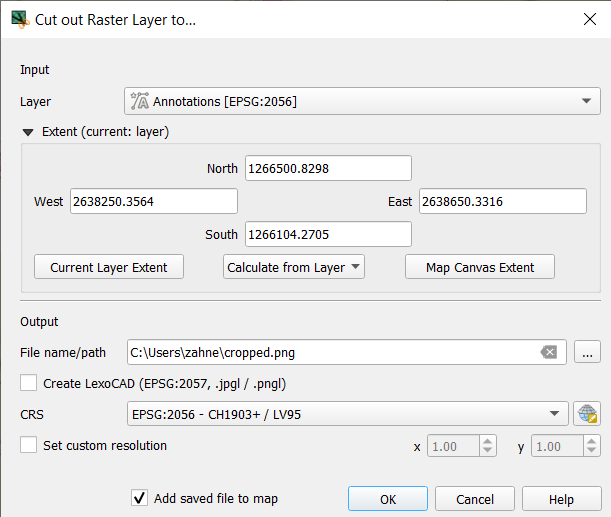

# Raster Cutter
***

Raster Cutter is a QGIS Plugin developed in Python and QT. It allows the user to select a raster layer from his project, set an extent and export the raster data within this extent to a `.jpg` or `.png` image file. 

Additionally, the plugin can create a Worldfile and/or Lexocad sidecar file if desired. The plugin also supports re-projection into other Coordinate Reference Systems.

### Using this tool

*Work in Progress*

### Set up local developement

If you want to continue developing this tool on your own, you will need the following:
* Python
* QGIS (contained in [OSGEO4W](https://www.osgeo.org/projects/osgeo4w/))
* Qt Designer (if you want to update the UI) (contained in [OSGEO4W](https://www.osgeo.org/projects/osgeo4w/))
* Plugin Build Tool ([pb_tool](https://g-sherman.github.io/plugin_build_tool/))

